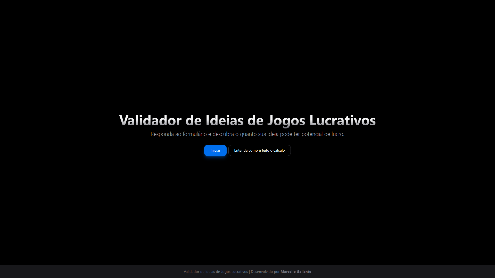

<h3 align="center">Validador de Ideias de Jogos Lucrativos</h3>

<div align="center">

[]()


[](https://github.com/MllGll/validador-de-jogos-lucrativos/blob/main/LICENSE)

</div>

<p align="center">



</p>

## 📝 Apêndice

- [Sobre](#about)
- [Regras de avaliação](#rules)
- [Rodando localmente](#installation)
- [Ferramentas utilizadas](#built_using)
- [Suporte](#support)
- [Autores](#authors)

## 🧐 Sobre <a name = "about"></a>

Como entusiasta e estudante na área de desenvolvimento de jogos, identifiquei uma necessidade que afeta especialmente desenvolvedores e equipes independentes durante a etapa de planejamento e pesquisa de mercado.

Este projeto busca atender a essa demanda por meio de um formulário projetado para oferecer suporte na avaliação crítica de ideias ou conceitos de jogos, considerando uma perspectiva essencialmente lucrativa.

O formulário é composto por perguntas que abordam diferentes aspectos do produto. Através de um sistema de pontuação estruturado, ele auxilia na análise do valor de mercado e do potencial de sucesso do jogo. Os critérios avaliados incluem fatores como popularidade, relevância e o interesse do público-alvo.

Por favor, sinta-se a vontade para compartilhar críticas, sugestões ou melhorias para aprimorar o método de avaliação.

## 🏁 Regras de avaliação <a name = "rules"></a>

- O produto é conhecido internacionalmente? Caso sim, +5 pontos
- O produto esteve em alta nos últimos anos em outras mídias? Caso sim, +3 pontos
- O tema/gênero do produto esteve em alta nos últimos anos? (Últimos 5 anos) Caso sim, +2 pontos
- Existe algum jogo recém-lançado focado no produto? Caso não, +3 pontos
    - Alcançou um público grande ou obteve um feedback positivo? Caso não, +1 ponto
- Existe uma demanda por um jogo do produto? Caso sim, +3 pontos
- O público-alvo do produto em outras mídias é grande? Caso sim, +1 ponto
- O público-alvo de um jogo do produto é grande? Caso sim, +3 pontos

## 💻 Rodando localmente <a name = "installation"></a>

Essas instruções irão lhe fornecer uma cópia do projeto para que você possa executá-lo em sua própria máquina para fins de desenvolvimento e testes.

Clone o projeto e abra no editor
```
git clone https://github.com/MllGll/validador-de-jogos-lucrativos.git
```

Instale as dependências
```
npm install
```

Inicie o servidor
```
npm run start
```

Assim que o projeto for executado, abra a porta referenciada no terminal no navegador de sua preferência.

## ⛏️ Ferramentas utilizadas <a name = "built_using"></a>

- [React](https://react.dev/) - Biblioteca JavaScript
- [Vite](https://vite.dev/) - Servidor de desenvolvimento
- [NextUI](https://nextui.org/) - Biblioteca de UI para React

## ❓ Suporte <a name = "support"></a>

Para suporte, envie um email para marcellogallante@gmail.com ou navegue pelas [issues](https://github.com/MllGll/validador-de-jogos-lucrativos/issues).


## ✍️ Autores <a name = "authors"></a>

- [@MllGll](https://github.com/MllGll) - Criador